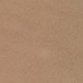
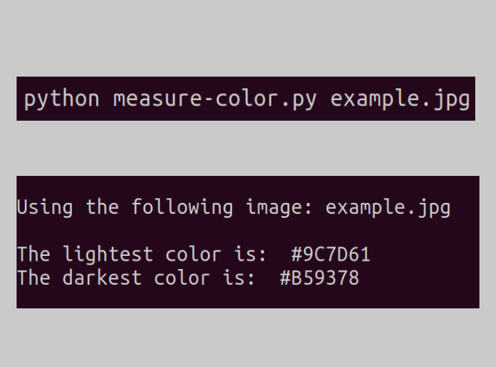
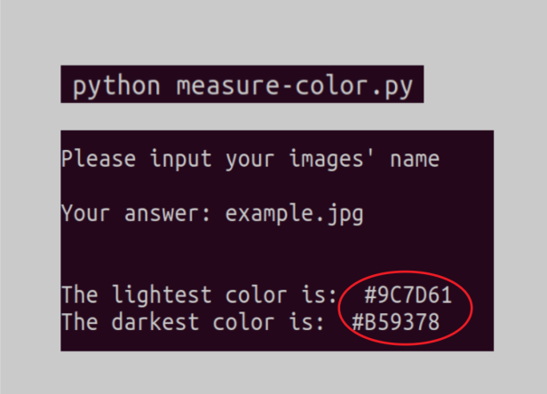

# darkest-and-lightest
Outputs the HEX of an RGB image's darkest and lightest colors

<b>Given an example image</b> 
 

<b>Option a:</b> run <i>python measure-color.py example.jpg</i> 
 

<b>Option b:</b> run <i>python measure-color.py</i> and, when requested, input <i>example.jpg</i> 

